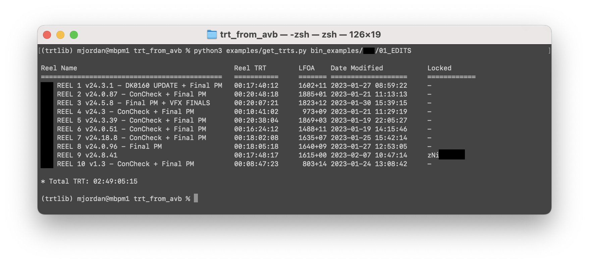

# avbutils

This is a sort of wrapper around the amazing [`pyavb`](https://github.com/markreidvfx/pyavb) library, with tools and utilities for assistant editors such as myself.  `avbutils` allows you to programmatically read Avid bins directly, without the usual need to export EDLs/AAFs/XMLs.

## Example Programs

### get_trts.py

Found at: `examples/get_trt.py`.  A command-line program to calculate the TRT directly from your Avid project's Reel bins, without requiring any EDL/AAF/XML exports.

This assumes a feature is divided into Reel bins, and will select the most recent version of each Reel from each Reel Bin.

Usage for the example command-line program:

```bash
python3 examples/get_trts.py /path/to/binsfolder/ [--head 8:00] [--tail 3:23] [--trt-adjust 0:00]
```


