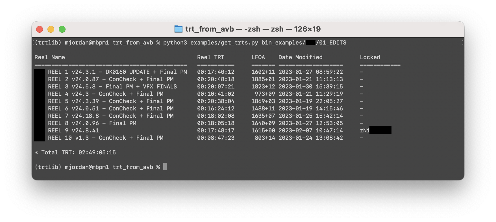

> [!Warning]
> Expect this to constantly break for now.  I'm using this as a "scratch pad" at the moment; it's gonna be a huge mess for anyone else for the time being.
> For now, if you're interested in how I do things, feel free to just copy out what you like into your own project. I don't mind. It's okay.  It's fine.  No!  No really.
> Once things get settled, I'll flesh this out and make it nicer.

# avbutils

This is a sort of wrapper around the amazing [`pyavb`](https://github.com/markreidvfx/pyavb) library.  Essentially, [`pyavb`](https://github.com/markreidvfx/pyavb) provides the capability to programmatically interact with Avid bins, allowing you to read and write them directly. `avbutils`, in turn, contextualizes these capabilities, making them more accessible and intuitive for assistant editors and the like (such as myself).

## Example Programs

### get_trts.py

Found at: `examples/get_trt.py`.  A command-line program to calculate the TRT directly from your Avid project's Reel bins, without requiring any EDL/AAF/XML exports.

This assumes a feature is divided into Reel bins, and will select the most recent version of each Reel from each Reel Bin.

Usage for the example command-line program:

```bash
python3 examples/get_trts.py /path/to/binsfolder/ [--head 8:00] [--tail 3:23] [--trt-adjust 0:00]
```


