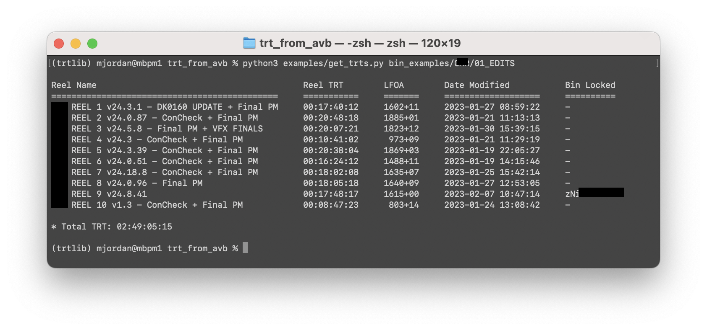

trt_from_AVBs
=============

A toolkit to calculate the TRT directly from your Avid project's Reel bins, without requiring any EDL/AAF/XML exports.

Obviously every project will be set up differently, but `trtlib` contains the tools you can assemble into what you need.

Example Program
---------------

An example program can be found at `examples/get_trt.py`.  This assumes a feature is divided into Reel bins, and will select the most recent version of each Reel from each Reel Bin.

Usage for the example command-line program:

```bash
python3 examples/get_trts.py /path/to/binsfolder/ [--head 8:00] [--tail 4:00]
```


